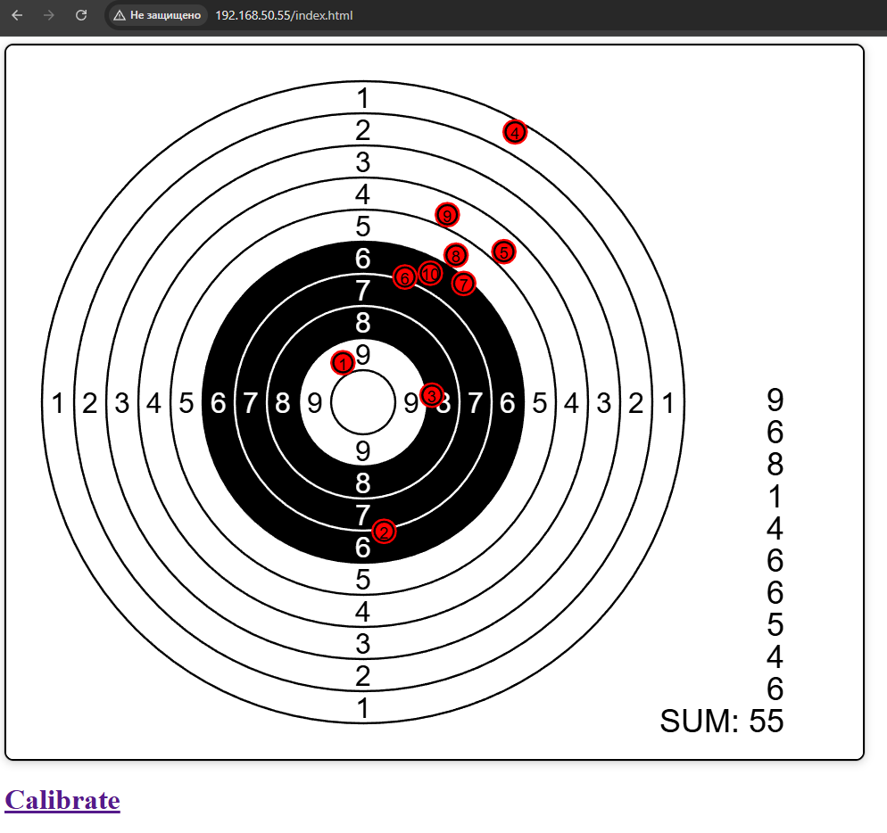
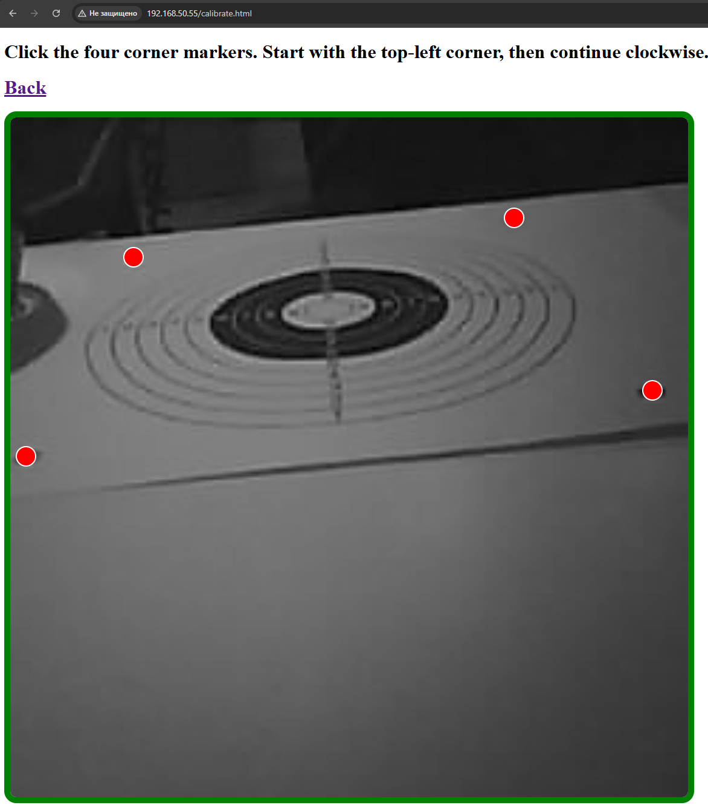
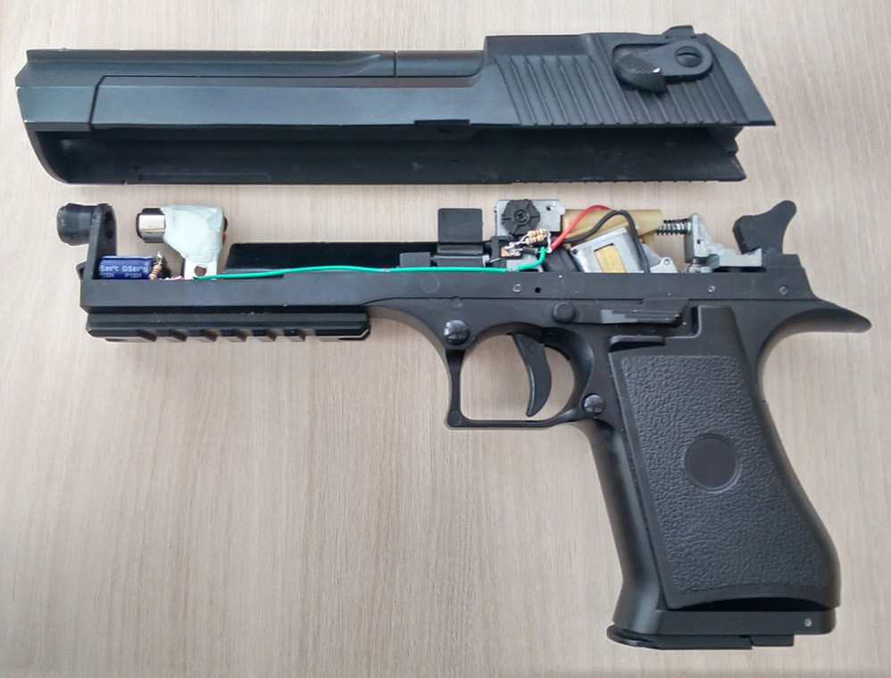
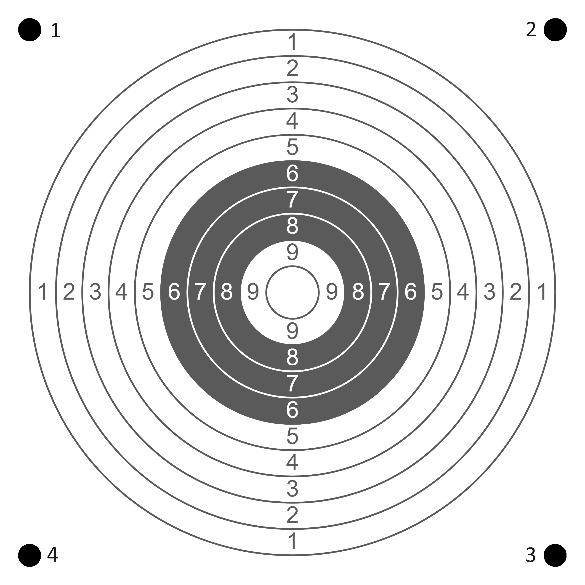

# ESP32LaserRange

A super-low-cost **home laser shooting range** built with **ESP32 + OV2640 camera**.  
The ESP32 continuously captures the target image, detects the **laser spot from a toy gun**, and shows the hit positions and score in a built-in web interface - just open the index.html page on your computer or tablet.

The camera may be mounted at an angle — the project applies **perspective correction (homography)** so the detected hit is mapped to the target plane accurately after calibration. Calibration settings are saved in flash memory.

This project is written for **Arduino IDE**.

---

## Features

- Detects laser spot from a toy laser gun
- Target view with hit markers and scoring
- Built-in web server (no PC software required)
- 4-point calibration with perspective correction
- Based on ESP32 + OV2640 camera module
- Playing gunshot sounds
- Very cheap & DIY-friendly

---

## How it works

1. The ESP32 camera continuously captures the target area (60 frames per sec)
2. A bright laser spot is detected in the frame.
3. The spot is transformed into target-plane coordinates.
4. A web page:
   - target diagram
   - hit markers
   - total score
   - play sound

Two web pages are available:

- **Main page** → target + hits + score
- [](docs/images/index.png) 
- **Calibration page** → select 4 markers on the image (starting from the top left corner of the TARGET and continuing clockwise). Calibration settings are saved in ESP32 flash memory
- [](docs/images/calib.png) 

---

## Requirements

### Hardware
- ESP32 cam module **with PSRAM** (I used the Freenove ESP32 Wrover CAM module)
- OV2640 camera
- Laser pointer. Ensure the laser pulse duration is about 10 milliseconds. I'll leave the implementation to you. I made this one:
- [](docs/images/weapon.jpg) 
- Wi-Fi network
- Print and hang the target:
- [](docs/images/print_target.png) 
- Position the ESP32 so the camera sees the target as closely as possible. Viewing from an angle isn't critical—the code applies perspective correction.

### Software
- Arduino IDE

### Libraries
Install:
- ESPAsyncWebServer (by ESP32Async)
- AsyncTCP (by ESP32Async)
- ArduinoJson
- JPEGDEC

---

## Setup

### Wi-Fi Configuration

Edit the following lines in  
`src/src.ino`:

```cpp
const char* WIFI_SSID = "ssid";
const char* WIFI_PASS = "pass";
```
Replace with your network credentials.

### Selecting Your ESP32 Camera Module
Open: `src/camera.h`
Uncomment the correct definition for your board, for example:
```cpp
#define CAMERA_MODEL_WROVER_KIT // Has PSRAM
//#define CAMERA_MODEL_ESP_EYE // Has PSRAM
//#define CAMERA_MODEL_ESP32S3_EYE // Has PSRAM
//#define CAMERA_MODEL_M5STACK_PSRAM // Has PSRAM
//#define CAMERA_MODEL_AI_THINKER // Has PSRAM
```
Leave only one active.
Boards marked “No PSRAM” will most likely not work.

## Upload & Run
- Flash the firmware.
- Position the ESP32 so the camera sees the target as closely as possible. Viewing from an angle isn't critical—the code applies perspective correction.
- Power up the device.
- Open the ESP32 IP address in your browser.

Calibration
- Open Calibration page (the link will be at the bottom of the main page).
- Starting from the top left corner of the TARGET and continuing clockwise (on the attached print of the target, the order of the dots is numbered).
- Once the points are selected, you can return to the main page.
- Calibration settings are saved in ESP32 flash memory. The procedure does not need to be repeated after turning off the power.

Start shooting 🙂

---
## License
MIT
---
## Credits
Built with love for DIY, computer vision and playful engineering ❤️
